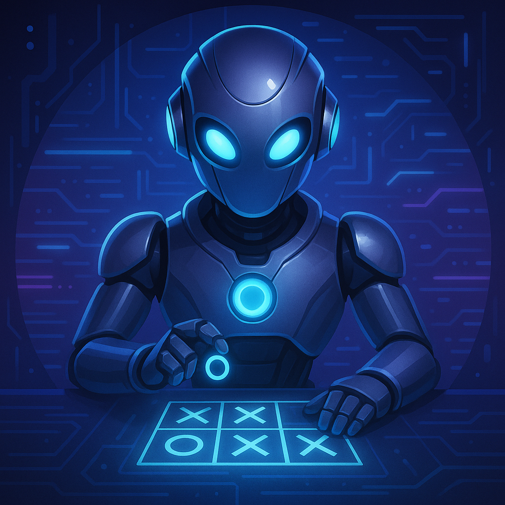
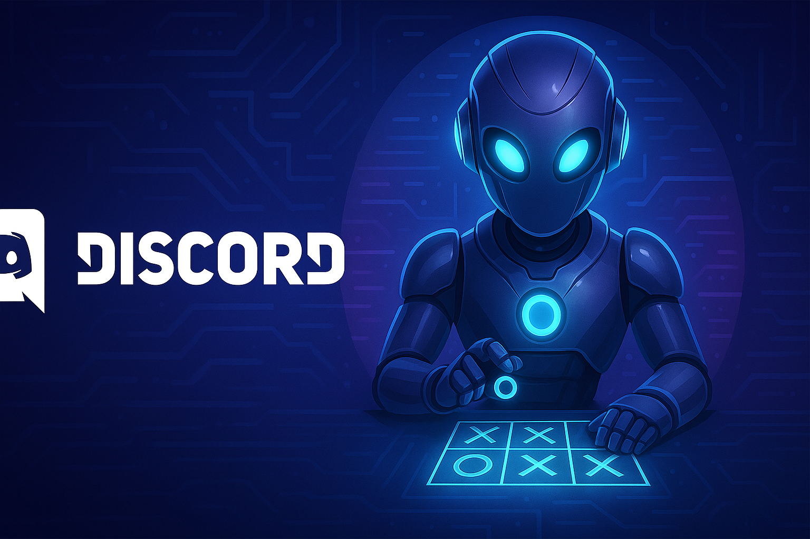

<h1 align="center">
  <br>
  
  <br>
  Ultimate Tic Tac Toe Discord Bot
  <br>
</h1>

<h4 align="center">A feature-rich Discord bot for playing Tic Tac Toe with friends or challenging AI opponents at different difficulty levels</h4>

<p align="center">
  <a href="./LICENSE">
    
  </a>
  <a href="https://github.com/Vic-41148/TicTacToe-Discord-Bot/issues">
    
  </a>
  <a href="https://github.com/Vic-41148/TicTacToe-Discord-Bot/stargazers">
    
  </a>
  <a href="https://github.com/Vic-41148/TicTacToe-Discord-Bot/network/members">
    
  </a>
  <a href="https://www.linkedin.com/in/adityashibu41148/">
    
  </a>
</p>

<p align="center">
  <a href="#overview">Overview</a>
  •
  <a href="#features">Features</a>
  •
  <a href="#installation">Installation</a>
  •
  <a href="#usage">Usage</a>
  •
  <a href="#commands">Commands</a>
  •
  <a href="#ai-difficulties">AI Difficulties</a>
  •
  <a href="#structure">Structure</a>
  •
  <a href="#contributing">Contributing</a>
  •
  <a href="#license">License</a>
</p>

<!-- <p align="center">
  
</p> -->

<p align="center">
  
  
  
</p>

<p align="center"> <a href="https://discord.com/oauth2/authorize?client_id=1389166563231273111&permissions=101376&integration_type=0&scope=bot" target="_blank">  </a> </p>

## 🎮 Overview
The Ultimate Tic Tac Toe Discord Bot brings the classic game to your Discord server with modern features. Play against friends or challenge AI opponents at different difficulty levels. The bot generates beautiful game boards, supports slash commands, and provides an engaging gaming experience right in your Discord channels.

## ✨ Features
- **Multiplayer Mode**: Challenge friends in your Discord server  
- **AI Opponents**: Play against computer at 3 difficulty levels  
- **Visual Game Boards**: Beautifully rendered game boards with custom graphics  
- **Slash Commands**: Modern, intuitive command interface  
- **Smart AI**: Uses minimax algorithm for unbeatable hard mode  
- **Input Validation**: Robust error checking for all commands  
- **Concurrency Control**: Prevents race conditions during gameplay  
- **Responsive Design**: Works seamlessly across desktop and mobile  

## 🛠️ Installation

### Prerequisites
- Python 3.8+  
- Discord bot token  
- pip package manager  

### Setup Steps
```bash
# Clone the repository
git clone https://github.com/Vic-41148/TicTacToe-Discord-Bot.git
cd TicTacToe-Discord-Bot

# Install dependencies
pip install -r requirements.txt

# Create .env file
echo "TOKEN=your_bot_token_here" > .env

# Run the bot
python bot.py
```

## 🖥️ Usage
After inviting the bot to your server:
1. Start a game with `/tictactoe @friend` or `/tictactoe hard`  
2. Make moves with `/move <row> <column>` (1-3)  
3. View game status with the embedded board image  
4. Cancel games with `/cancel`  

## ⌨️ Commands
| Command               | Description                             | Example               |
|-----------------------|-----------------------------------------|-----------------------|
| `/tictactoe @user`    | Start game with another user            | `/tictactoe @friend`  |
| `/tictactoe easy`     | Play against easy AI                    | `/tictactoe easy`     |
| `/tictactoe medium`   | Play against medium AI                  | `/tictactoe medium`   |
| `/tictactoe hard`     | Challenge hard AI                       | `/tictactoe hard`     |
| `/move <row> <col>`   | Make your move (1-3)                    | `/move 2 3`           |
| `/cancel`             | Cancel current game                     | `/cancel`             |
| `/commands`           | Show help menu                          | `/commands`           |
| `/ping`               | Check bot latency                       | `/ping`               |

## 🤖 AI Difficulties
- **Easy**: Makes random valid moves  
- **Medium**: Blocks immediate threats and takes opportunities  
- **Hard**: Uses minimax algorithm with alpha-beta pruning (unbeatable)  

## 🧱 Structure

```
TicTacToe-Discord-Bot/
├── assets/                # Visual assets
├── src/                   # Bot source code
│   ├── bot.py             # Main bot file
│   └── game_logic.py      # Core game mechanics
├── requirements.txt       # Dependencies
├── .env                   # Environment variables
├── LICENSE                # MIT License
└── README.md              # This documentation
```

## 🤝 Contributing
1. Fork the repository  
2. Create your feature branch (`git checkout -b feature/your-feature`)  
3. Commit changes (`git commit -m 'Add feature'`)  
4. Push to branch (`git push origin feature/your-feature`)  
5. Open a pull request  

## 📝 License
Distributed under the [MIT License](LICENSE).

## 📬 Contact
**Aditya Shibu**  
[LinkedIn](https://www.linkedin.com/in/adityashibu41148/)  
✉️ adityashibu41148@gmail.com

Project Link: https://github.com/Vic-41148/TicTacToe-Discord-Bot
